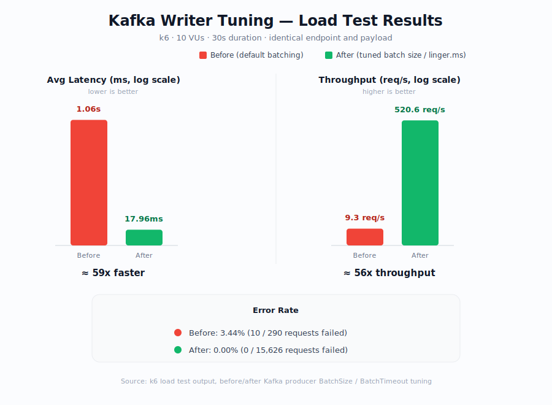

# 🚀 Waterfall – Multi-Tenant SaaS Distributed Job Scheduling Platform

A production-grade **SaaS job scheduling platform** built using **Golang, PostgreSQL, Redis, and Kafka**, designed with **Clean Architecture** and **Microservices** principles.

This platform enables tenants to register applications, schedule asynchronous jobs (immediate or future), monitor execution, and manage billing — while providing platform admins with full operational control and observability.

---

# 📌 Problem Statement

Modern SaaS systems require:

- Reliable background job execution
- Scheduled & delayed job processing
- Multi-tenant isolation
- Retry & Dead Letter Queue handling
- Usage-based billing
- Observability & monitoring
- Secure authentication & RBAC

This platform solves these challenges in a scalable, production-ready way.

---

# 🏗️ Architecture Overview

The system follows:

- Clean Architecture
- Service–Repository Pattern
- SOLID Principles
- Domain-driven design
- Microservices Architecture

Each service is independently deployable and scalable.

---

# 🧩 Microservices

1. API Service – Public REST APIs for tenants  
2. Admin Service – Platform admin management APIs  
3. Job Service – Core job management & state machine  
4. Scheduler Service – Moves scheduled jobs to queue    
5. Watcher Service – Monitors worker & pick jobs moves to db 
6. Billing Service – Usage tracking & subscription handling  

---

# 🛠 Tech Stack

Backend:
- Golang
- PostgreSQL
- Redis Streams / Kafka
- JWT Authentication
- RBAC Authorization
- Prometheus
- Grafana

Infrastructure:
- Docker
- Docker Compose
- Environment-based configuration (.env)
- Structured logging

---

# 🏛 Clean Architecture Structure

Each service follows this structure:

```text
├── domain/
│   ├── entity/
│   │   └── job.go
│   ├── repository/
│   │   └── job_repository.go
│   └── service/
│       └── job_service.go
│
├── usecase/
│   └── job_usecase.go
│
├── repository/
│   └── postgres_job_repository.go
│
├── delivery/
│   ├── http/
│   │   └── job_handler.go
│   └── grpc/
│       └── job_grpc.go
│
└── dto/
    ├── create_job_request.go
    └── job_response.go

```

Architecture flow:

Controller → UseCase → Repository Interface → Repository Implementation

This ensures:
- Testability
- Loose coupling
- Dependency inversion
- Maintainability

---

# 🔐 Authentication & Authorization

Platform Admin:
- Admin login
- JWT Access + Refresh tokens
- List all tenants
- Block / Unblock tenant
- View billing per tenant
- Inspect jobs & DLQ

Tenant:
- Tenant registration
- AppID & API key generation
- Worker registration
- RBAC user roles
- Tenant login (JWT)
- Monitor jobs by role

---

# 🧵 Job Lifecycle

Immediate Jobs:
1. Tenant creates job via API
2. Job stored in PostgreSQL
3. Job pushed to Redis/Kafka
4. Worker consumes & executes
5. Status updated

Scheduled Jobs:
1. schedule_at column used
2. Job state = SCHEDULED
3. Scheduler scans due jobs
4. Moves job to queue
5. Worker executes

---

# 🔁 Reliability Features

- Retry mechanism with exponential backoff
- retry_count & max_retries tracking
- Dead Letter Queue (DLQ)
- Manual retry API
- Job state machine enforcement
- Idempotent execution
- Execution locks
- Correlation IDs for tracing

---

## Performance: Kafka Writer Tune



---

## For Full report download and open in browser

### Before
[Download k6 report (open in browser)](docs/reports/report-before.html)

### After
[Download k6 report (open in browser)](docs/reports/report.html)

---

# 💳 Billing & Monetization

- Tier-based pricing
- Per-job execution tracking
- Per-retry tracking
- Daily usage metering
- Subscription plans
- Invoice generation
- Quota enforcement
- Soft limits & grace periods
- Automatic job blocking if quota exceeded

---

# 📊 Observability

Prometheus Metrics:
- Jobs created
- Jobs succeeded
- Jobs failed
- Retry count
- Queue depth
- Worker count
- Throughput

Grafana Dashboards:
- Job throughput dashboard
- Worker health dashboard
- Queue lag monitoring
- Failure rate visualization

---

# 🗃 Database Tables

Core tables:

- tenants
- users
- apps
- jobs
- job_logs
- dlq_jobs
- usage_daily
- subscriptions
- invoices

---

# 🧠 Job State Machine

CREATED → QUEUED → RUNNING → SUCCESS  
                         ↓  
                      FAILED → RETRYING  
                                   ↓  
                                DLQ  

Only valid transitions are allowed.

---

# 🔐 Security

- JWT-based authentication
- Role-based access control (RBAC)
- API Key authentication for job creation
- Middleware-based token validation
- Tenant isolation
- Environment-based secret management
- No hardcoded credentials

---

# 📦 Example APIs

Tenant:

POST /v1/tenants  
POST /v1/auth/login  
POST /v1/jobs (X-API-KEY required)  
GET /v1/jobs/{id}  

Admin:

POST /admin/login  
GET /admin/tenants  
PATCH /admin/tenants/{id}/block  
GET /admin/tenants/{id}/billing  

---

# 🚀 Running the Project

```bash
# Clone Repository
git clone https://github.com/Varunjp/waterfall.git
cd waterfall

# Set up environment variables
cp .env.example .env

# Install dependencies
go mod tidy

# Run all service
go run main.go
```


2. Create .env file
```env
DB_HOST=localhost
DB_PORT=5432
DB_USER=postgres
DB_PASSWORD=postgres
DB_NAME=waterfall

REDIS_HOST=localhost
REDIS_PORT=6379

KAFKA_BROKER=localhost:9092

JWT_SECRET=supersecret
```

---

# 🧪 Testing Strategy

- Unit tests for usecases
- Repository mock testing
- Integration testing
- Retry simulation tests
- Scheduler restart tests
- Load testing for scaling

---

# 📈 Scaling Strategy

- Horizontal worker scaling
- Consumer group balancing
- Backpressure handling
- Autoscaling based on metrics
- Queue depth monitoring

---

# 🎯 Engineering Decisions

Clean Architecture – Maintainability & testability  
Redis Streams / Kafka – Distributed queue reliability  
PostgreSQL – ACID guarantees  
JWT – Stateless authentication  
RBAC – Multi-role security  
Microservices – Independent scaling  
Prometheus – Native Go support  
Structured logging – Production debugging  

---

# 📚 Learning Outcomes

This project demonstrates:

- Distributed systems fundamentals
- Exactly-once execution simulation
- Retry & DLQ design patterns
- Multi-tenant SaaS architecture
- Billing system design
- Production monitoring setup
- Clean Architecture mastery
- System reliability engineering

---

# 🏁 Production Readiness Checklist

[✔] Structured logging  
[✔] Centralized error handling  
[✔] JWT authentication  
[✔] RBAC  
[✔] Retry engine  
[✔] DLQ  
[✔] Scheduler reliability  
[✔] Billing enforcement  
[✔] Metrics & monitoring  
[✔] Dockerized services  
[✔] Environment-based configuration  

---

# 👨‍💻 Author

Varun JP  
Backend Engineer – Golang  
Distributed Systems & Scalable Architecture Enthusiast  
